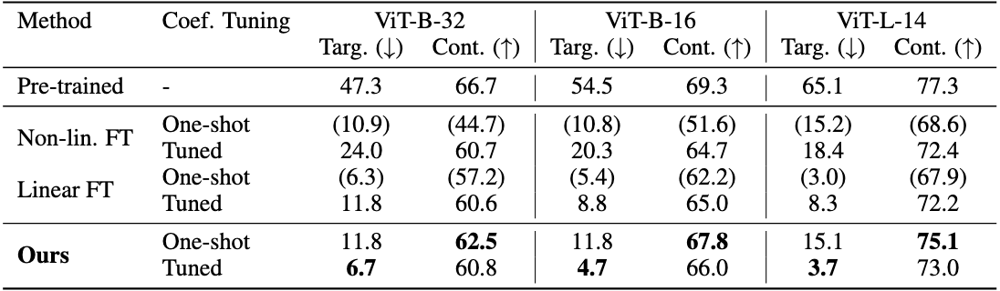

# [Mastering Task Arithmetic:\\ $\tau$Jp as a Key Indicator for Weight Disentanglement]()

 \\



## Abstract
Model-editing techniques using task arithmetic (Ilharco et al., 2022) have rapidly gained attention. Through task arithmetic, simply through arithmetic operations on the weights of pre-trained and fine-tuned models create desired models, such as multi-task models, models with specific tasks unsolvable, or domain-transferred models. However, task arithmetic faces challenges, such as low reproducibility and the high cost associated with adjusting coefficients in the arithmetic operations on model parameters, which have limited its practical success. In this paper, we present three key contributions in the context of task addition and task negation within task arithmetic. First, we propose a new metric called $\tau$Jp which is based on the product of the task vector ($\tau$) and the Jacobian of the pre-trained model with respect to its weights. We show that $\tau$Jp has a causal relationship with the interference that occurs from arithmetic operations. Second, we show that introducing regularization to minimize $\tau$Jp significantly mitigates interference between task inferences, which leads to eliminating coefficient tuning and better accuracy on each task. Third, in the context of continual learning, we confirmed that our $\tau$Jp regularization demonstrates more robust performance in environments where future tasks to be learned are not accessible, confirming the scalability of the approach. Finally, we demonstrate that the $\tau$Jp regularizer further reinforces the performance of task arithmetic by leveraging publicly available fine-tuned models, offering practical benefits for real-world applications.

## Setup environment
Create a virtual environment
```
python3 -m venv tau_jp
```
Activate the virtual environment
```
source tau_jp/bin/activate
```
Install the required packages from requirements.txt
```
pip install -r requirements.txt
```

## Download datasets
Datasets to download:
1. [Cars](https://www.cv-foundation.org/openaccess/content_iccv_workshops_2013/W19/html/Krause_3D_Object_Representations_2013_ICCV_paper.html)
2. [DTD](https://openaccess.thecvf.com/content_cvpr_2014/html/Cimpoi_Describing_Textures_in_2014_CVPR_paper.html)
3. [EuroSAT](https://ieeexplore.ieee.org/abstract/document/8736785)
4. [MNIST](https://yann.lecun.com/exdb/mnist/)
5. [GTSRB](https://ieeexplore.ieee.org/abstract/document/6033395?casa_token=MLJHRCUz8OIAAAAA:9ZMwyQ50HzTzmSkEN1_HBYOFNzPazeKICIKKd3t6g-VgtGc5c7U5tphTVEykAsbcViJUXYFr7UcE)
6. [RESISC45](https://ieeexplore.ieee.org/abstract/document/7891544?casa_token=ZOFbRb8TSDUAAAAA:83ANrYS19nlCWRtLylfeuqD3akKWlSeGE86H0gTFcQkRlENegFj9Brgt-dSBDl_MUcZiUPpdcljp)
7. [SUN397](https://link.springer.com/article/10.1007/s11263-014-0748-y)
8. [SVHN](https://research.google/pubs/reading-digits-in-natural-images-with-unsupervised-feature-learning/)
9. [ImageNet](https://ieeexplore.ieee.org/document/5206848)

We are using the same datasets as [this repository](https://github.com/mlfoundations/task_vectors).

For Cars, the original download link is broken, so please refer to this [issue](https://github.com/pytorch/vision/issues/7545) for a workaround. For DTD, EuroSAT, RESISC45, and SUN397, the datasets need to be manually split after downloading. Please refer to this [issue](https://github.com/mlfoundations/task_vectors/issues/1) for details.

## Content
The contents of this repository are based on [Ilharco et al., 2023](https://github.com/mlfoundations/task_vectors) and [Ortiz-Jimenez et al., 2023](https://github.com/gortizji/tangent_task_arithmetic) and share the same structure.

<!-- 
## Paper Authors
[Kotaro Yoshida](https://github.com/katoro8989)

[Yuji Naraki](https://github.com/yujisw)

[Ryosuke Yamaki](https://github.com/Ryosuke-Yamaki)

[Takahumi Horie](https://github.com/NotWeButRun)

[Ryotaro Shimizu](https://github.com/jchanxtarov)

[Yuki Saito](https://github.com/wildsnowman)

[Hiroki Naganuma](https://github.com/Hiroki11x)


## Citation

```

```
-->
